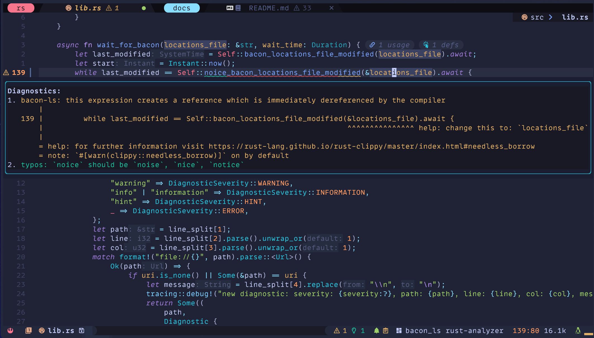

# 🐽 Bacon Language Server 🐽
[](https://github.com/crisidev/bacon-ls/actions?query=workflow%3Atest)
[](https://crates.io/crates/bacon-ls)
[](https://github.com/crisidev/bacon-ls/blob/main/LICENSE)

LSP Server wrapper for the exceptional [Bacon](https://dystroy.org/bacon/) exposing [textDocument/diagnostic](https://microsoft.github.io/language-server-protocol/specification#textDocument_diagnostic) and [workspace/diagnostic](https://microsoft.github.io/language-server-protocol/specification#workspace_diagnostic) capabilities.

See `bacon-ls` 🐽 blog post: https://lmno.lol/crisidev/bacon-language-server



`bacon-ls` 🐽 is meant to be easy to include in your IDE configuration.

<!-- vim-markdown-toc Marked -->

* [Features - ✅ done 🕖 in progress 🌍 future](#features---✅-done-🕖-in-progress-🌍-future)
* [Installation](#installation)
* [Configuration](#configuration)
    * [Neovim - LazyVim](#neovim---lazyvim)
    * [Neovim - Manual](#neovim---manual)
* [How does it work?](#how-does-it-work?)
* [Thanks](#thanks)

<!-- vim-markdown-toc -->

## Features - ✅ done 🕖 in progress 🌍 future

- 🔥 **`bacon-ls` 🐽 does not start `bacon` for you, it requires it running in another terminal**
- ✅ Implement LSP server interface for `textDocument/diagnostic` and `workspace/diagnostic` 
- ✅ Manual Neovim configuration
- ✅ Manual [LazyVim](https://www.lazyvim.org) configuration
- 🕖 Automatic NeoVim configuration
    - ✅ Add `bacon-ls` to [nvim-lspconfig](https://github.com/neovim/nvim-lspconfig/) - https://github.com/neovim/nvim-lspconfig/pull/3160 
    - 🕖 Add `bacon` and `bacon-ls` to [mason.nvim](https://github.com/williamboman/mason.nvim) - https://github.com/mason-org/mason-registry/pull/5774
    - 🕖 Add `bacon-ls` to LazyVim [Rust extras](https://github.com/LazyVim/LazyVim/blob/main/lua/lazyvim/plugins/extras/lang/rust.lua) - https://github.com/LazyVim/LazyVim/pull/3212
- ✅ Add compiler hints to [Bacon](https://dystroy.org/bacon/) export locations - https://github.com/Canop/bacon/pull/187 https://github.com/Canop/bacon/pull/188
- 🌍 VsCode extension and configuration
- 🌍 Emacs configuration


## Installation

First, install [Bacon](https://dystroy.org/bacon/#installation) and `bacon-ls` 🐽

```bash
❯❯❯ cargo install --locked bacon bacon-ls
```

Configure Bacon export-locations settings with `bacon-ls` 🐽 export format:

```toml
[export]
enabled = true
path = ".bacon-locations"
line_format = "{kind}:{path}:{line}:{column}:{message}"
```

## Configuration
The language server can be configured using the appropriate LSP protocol and
supports the following values:

* `locationsFile` Bacon export filename, default `.bacon-locations`.
* `waitTimeSeconds` Maximum time in seconds the LSP server waits for Bacon to 
update the export file before loading the new diagnostics, default `10`.

### Neovim - LazyVim 
```lua
return {
    {
        "neovim/nvim-lspconfig",
        opts = {
            diagnostics = {
                update_in_insert = true,
            },
            servers = {
                rust_analyzer = { enable = false },
                bacon_ls = { 
                    enable = true 
                    settings = {
                        -- locationsFile = ".locations",
                        -- waitTimeSeconds = 5
                    },
                },
            },
        },
    },
    {
        "mrcjkb/rustaceanvim",
        opts = {
            default_settings = {
                ["rust-analyzer"] = { 
                    diagnostics = { enable = false },
                    checkOnSave = { enable = false },
                },
            },
        },
    },
}
```

### Neovim - Manual

NeoVim requires [nvim-lspconfig](https://github.com/neovim/nvim-lspconfig/) to be configured 
and [rust-analyzer](https://rust-analyzer.github.io/) diagnostics must be turned off for Bacon-Ls 🐽 
to properly function.

`bacon-ls` is part of `nvim-lspconfig` from commit 
[6d2ae9f](https://github.com/neovim/nvim-lspconfig/commit/6d2ae9fdc3111a6e8fd5db2467aca11737195a30)
and it can be configured like any other LSP server works best when 
[vim.diagnostics.Opts.update_in_insert](https://neovim.io/doc/user/diagnostic.html#vim.diagnostic.Opts)
is set to `true`.

```lua
require("lspconfig.configs").bacon_ls.setup({
    autostart=true,
    settings = {
        -- locationsFile = ".locations",
        -- waitTimeSeconds = 5
    },
})
```

For `rust-analyzer`, these 2 options must be turned off:

```lua
rust-analyzer.checkOnSave.enable = false
rust-analyzer.diagnostics.enable = false
```
## How does it work?

`bacon-ls` 🐽 reads the diagnostics location list generated
by [Bacon's export-locations](https://dystroy.org/bacon/config/#export-locations) 
and exposes them on STDIO over the LSP protocol to be consumed
by the client diagnostics.

It requires [Bacon](https://dystroy.org/bacon/) to be running alongside 
to ensure regular updates of the export locations.

The LSP client reads them as response to `textDocument/diagnostic` and `workspace/diagnostic`.

## Thanks
`bacon-ls` 🐽 has been inspired by [typos-lsp](https://github.com/tekumara/typos-lsp).
